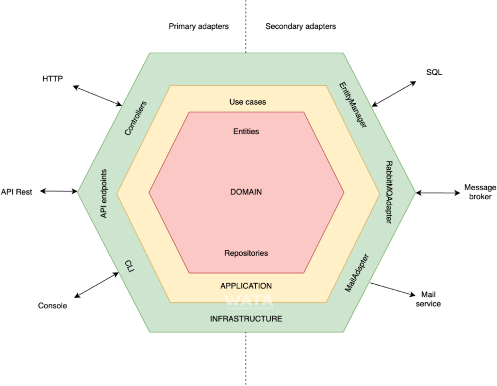

# Hexagonal Architecture
Hexagonal architecture, or ports and adapters architecture, is an architectural pattern that falls under the clean architecture category. Its goal is to create loosely coupled application components that can be easily connected to their software environment using ports and adapters. This makes components interchangeable at any level and facilitates test automation.
## Principle
Hexagonal architecture divides a system into several interchangeable and loosely coupled components. The main idea is that the business logic is not coupled with any external element, such as a framework, a database, etc.

## Benefits
- **Framework independent**: The project will never depend on an external framework, since there will always be a layer that abstracts the logic and allows changing the frameworks without affecting the application.
- **Testable**: The business logic can be tested independently.
- **Database independent**: The application domain does not know how the information is structured and stored.
- **Independent of external agents**: The business logic is not aware of the existence of an external agent.

## Layered structure
The hexagonal architecture proposes describing the application in several layers. The code of each layer would describe how to communicate with the others through interfaces (ports) and implementations (adapters).

### The domain layer
This is the central layer of the hexagon and contains the business rules. It usually has these components:

- **Services**: They implement the business logic. They use ports (repository interfaces) and entity classes to communicate with the outside.
- **Ports or repositories**: Abstract classes that indicate how the communication between the service and the outside will be.
- **Entities**: These are data classes that encapsulate the data used by the services.

This layer does not know how the information in the repository is structured, stored and retrieved. It simply exposes a set of interfaces (ports) that are tailored in the infrastructure layer for each specific use case of this persistence implementation.
### The application layer
Above the domain layer is the application layer, where the different use cases are defined. When defining the use cases, we think about the interfaces that are available in the application hexagon and not about any of the available technologies that we can use.

### The infrastructure layer
This is the outermost layer of the hexagon and corresponds to the implementations or adapters of the ports of the other layers.

Normally, this layer corresponds to the framework, but it also contains third-party libraries, SDKs or any other code that is external to the application.

In addition, this layer contains the integration of the classes, implementing the dependency injection. In this case it is the Wirings folder
### Communication between the layers
To achieve this, we use dependency injection, that is, we inject the dependencies into the class instead of instantiating them within the class. In this way, we have decoupled the classes from the other layers so that they depend on an interface rather than a concrete implementation.

So what we are achieving is reversing the control of the application, preventing our program from depending on a particular technology, allowing the technology to adapt to the requirements of the application.

The visibility of the different elements is as follows:

**Infrastructure** -> **Application** -> **Domain**

Elements can only be used in the direction of the arrow. That is, the domain can only use its own elements. The application its own and those of the domain. The infrastructure can use all of them.